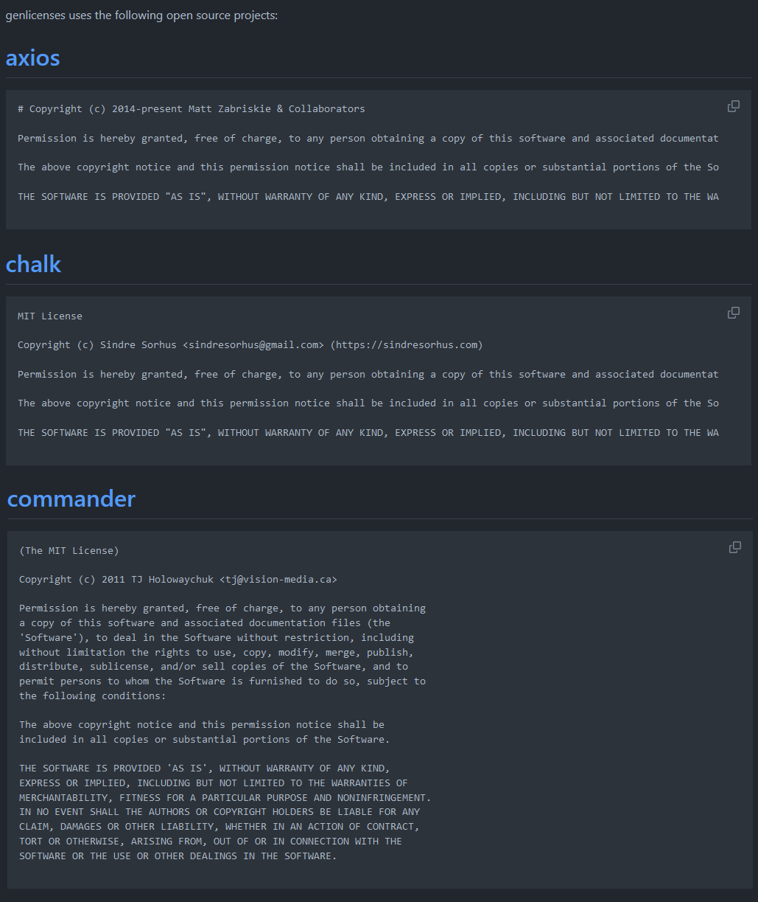

# GenLicenses
GenLicenses is an opensource CLI that helps developers managing their JavaScript projects by generating open source licenses from their projects's dependencies.

# Installing
```bash
npm i genlicenses -g
```

# Usage
When the utilitary is ran by the following command, a "docs" folder will be created at the root of the project containing a "LICENSES.md" file that holds all licenses
```bash
genlicenses
```
If the utilitary is ran with the devonly flag, then only the devDependencies's licenses of the project will be generated
```bash
genlicenses --devonly
```
On the contrary, if used with the prodonly flag, then only the dependencies's licenses of the project will be generated
```bash
genlicenses --prodonly
```

# Example output


# License
GenLicenses is under a MIT License, see [LICENSE](LICENSE) for more information.
